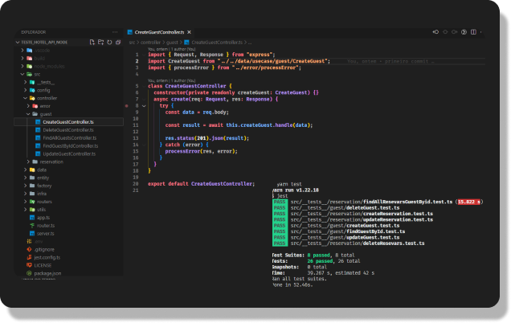
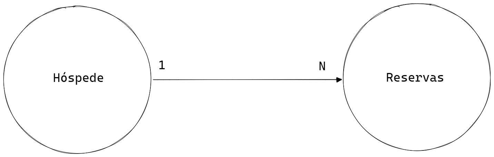

<h1 align="center">Api Hotel</h1>

  <a href="#-tecnologias">Tecnologias</a>&nbsp;&nbsp;&nbsp;|&nbsp;&nbsp;&nbsp;
  <a href="#-projeto">Projeto</a>&nbsp;&nbsp;&nbsp;|&nbsp;&nbsp;&nbsp;
  <a href="#-diagrama">Diagrama</a>&nbsp;&nbsp;&nbsp;|&nbsp;&nbsp;&nbsp;
  <a href="#-como-executar">Como executar</a>&nbsp;&nbsp;&nbsp;|&nbsp;&nbsp;&nbsp;
  <a href="#-licença">Licença</a>

  

 

  

## ✨ Tecnologias

Esse projeto foi desenvolvido com as seguintes tecnologias:

- [TypeScript](https://www.typescriptlang.org/)
- [Swagger](https://swagger.io/)
- [Yup](https://yarnpkg.com/package/yup)
- [TypeORM](https://typeorm.io/#/)
- [Express](https://expressjs.com/pt-br/)
- [Jest](https://jestjs.io/)
- [MongoDb](https://www.mongodb.com/)

## 💻 Projeto

Desenvolver uma API, utilizando Node.JS, para uma aplicação de gerenciamento de Hóspedes de um Hotel X e suas reservas. 

Hóspede deve conter dados básicos como:
- Nome
- E-mail
- Data de Aniversário
- Telefone
- Cidade
- Estado
- País

Dados da Reserva:
- Nome do Hotel
- Número do Quarto
- Valor da reserva
- Data da reserva efetuada
- Data Inicial e Final que a pessoa reservou o hotel
- Status da reserva(Confirmada, Cancelada, Check-in, Check-out)
## 🔶 Diagrama

## 🚀 Como executar

- Clone o repositório
- Instale as dependências com `yarn install or yarn`
- Nao e necessario cria um arquivo `.env`
- Inicie o servidor com `yarn dev`
- Pode testar as rotas com a documentação(swagger) acessado `localhost:8080/api-docs` 
- Ja os teste TDD pode ser executado com o comando `yarn test`

A aplicação pode ser acessada em [`localhost:8080/api`](localhost:8080/api).

## 📄 Licença

Esse projeto está sob a licença MIT. Veja o arquivo [LICENSE](LICENSE.md) para mais detalhes.
